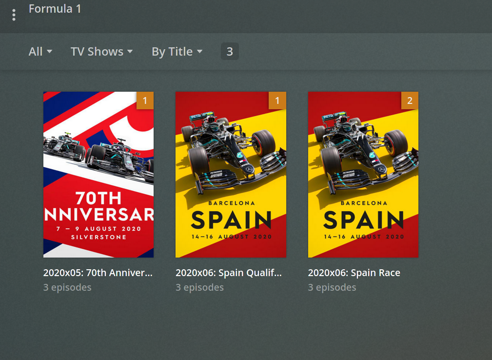

PlexF1MediaScanner
==================

Fork from [kennethx/PlexF1MediaScanner](https://github.com/kennethx/PlexF1MediaScanner). Props to them!

This is a custom scanner for Plex for parsing data for Formula 1 race weekends. It should be the scanner for a library that **only**
contains F1 content, it wont match anything else.

## Installation

- Copy the `Formula1.py` file to your Scanners directory, for Linux this is `/var/lib/plexmediaserver/Library/Application Support/Plex Media Server/Scanners/Series/`
- Add a new `TV shows` library called `Formula 1` (or whatever), add the folder containing F1 broadcasts.
- Under `Advanced`, select `Formula1` as the scanner and `Personal Media Shows` for the agent. Also set `Seasons` to `Hide` (we only ever have 1 season per session).

## Folder Structure

The script expects the media to be formatted similar to the below:

```
F1
├── Formula.1.2020x05.70th-Anniversary-GB.Race.SkyF1HD.1080p
│   ├── 01.Pre-Race.Buildup.mp4
│   ├── 02.Race.Session.mp4
│   ├── 03.Post-Race.Analysis.mp4
│   └── poster.jpg
└── Formula.1.2020x06.Spain.Qualifying.SkyF1HD.1080p
    ├── 01.Pre-Qualifying.Buildup.mp4
    ├── 02.Qualifying.Session.mp4
    ├── 03.Post-Qualifying.Analysis.mp4
    └── poster.jpg
```

Each F1 session will show as a TV Show in Plex, with each event (eg Qualifying, Race) showing as an episode inside that. Annoyingly you cannot have different sessions as different TV seasons without messing around with the folder structure. Here's what it looks like:



Note that it does **not** pull in any race-specific metadata, something like [SportScanner](https://github.com/mmmmmtasty/SportScanner) could probably be updated to support pulling dynamic metadata but its probably overkill and could risk spoilers being dropped into the event description. If you put a file named `poster.jpg` in each directory then that will show in the plex ui (shoutout to [r/formula1](reddit.com/r/formula1/) for some nice posters). The script does automatically drop in a fake poster for each episode, just so you dont get any spoilers in the auto-generated thumbnail images.

## Troubleshooting

Regular expressions aren't perfect (especially mine) and if your file and directory structure doesnt match what I think it is then stuff wont appear in your library.
To see what went wrong with detection, check out the log file (`/var/lib/plexmediaserver/Library/Application Support/Plex Media Server/Logs/Formula1.log`). 

To force plex to retry, first get the ID of the your F1 Library (`/usr/lib/plexmediaserver/Plex\ Media\ Scanner --list`) then force an update: `/usr/lib/plexmediaserver/Plex\ Media\ Scanner --force --scan --refresh --section YOUR_SECTION_NUMBER`.
